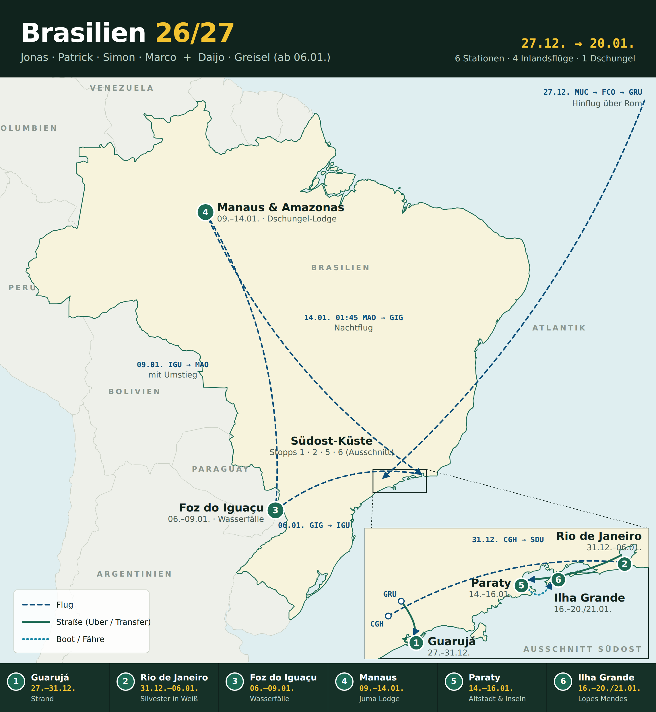

# Brasilien 2026/27: Reiseübersicht

**27.12.2026 – 20./21.01.2027** · Stand: 03.10.2026

**Webseite mit Heute-Ansicht, Karte, Drinks-Counter, Vorfreude-Kalender und Zeitkapsel:** https://claude.ai/artifact/3MHzcPCtQJY7Kx5XUHDGZE ·
**Offline:** [PDF](brasilien-reise.pdf) · **Kalender fürs Handy:** [Gringos plus 1 Cevapi](kalender/gringos-plus-1-cevapi.ics) · [Daijo & Greisel](kalender/daijo-greisel.ics)
(auf GitHub „Download raw file“, dann öffnen)

Legende für den Status: ✅ gebucht · 🟡 gebucht, Details prüfen · ⏳ geplant, noch nicht gebucht · ❓ unklar

---

## Wer reist wann

| Gruppe | Personen | Zeitraum |
|---|---|---|
| **Gringos plus 1 Cevapi** | Jonas, Patrick, Simon, Marco | 27.12.26 – 20.01.27 (alle vier bis zum Schluss) |
| **Daijo & Greisel** | Daijo, Greisel | 06.01.27 – nach dem 21.01.27 (danach noch Rio) |

Ab dem **06.01.** reisen alle sechs zusammen, bis sich die Gruppen auf der Ilha Grande wieder trennen.

---

## Route auf einen Blick

| # | Station | Datum | Nächte | Wer | Unterkunft | Status |
|---|---|---|---|---|---|---|
| 1 | **Guarujá** (Praia da Enseada) | 28.12. – 31.12. | 3 | A | Casa Praiana | ✅ bis 31.12. verlängert |
| 2 | **Rio de Janeiro** (Silvester!) | 31.12. – 06.01. | 6 | A | Tabas – Cena Carioca | ✅ auf 31.12. umgebucht |
| 3 | **Foz do Iguaçu** (Wasserfälle) | 06.01. – 09.01. | 3 | alle | TuCasa Flats | ✅ |
| 4a | **Manaus** | 09.01. – 10.01. | 1 | alle | Casa 307 | ✅ |
| 4b | **Amazonas: Juma Lodge** | 10.01. – 13.01. | 3 | alle | Juma Kabanas, „Nature Experience“ | ✅ |
| – | Manaus → Nachtflug | 13.01. → 14.01. | 0 | alle | keine (Flug 01:45) | ⏳ |
| 5 | **Paraty** | 14.01. – 16.01. | 2 | alle | Geko Pousada Paraty | ✅ |
| 6 | **Ilha Grande** (Vila do Abraão) | 16.01. – 20.01. (Gringos plus 1 Cevapi) / 21.01. (Daijo & Greisel) | 4 / 5 | alle | **noch offen** (Vorschlag: Balaio Hostel) | ⏳ |
| – | Heimreise A: Rio-GIG 15:35 → Rom → München / Rio-Verlängerung B | 20.01. → 21.01. / ab 21.01. | | | | ✅ / ❓ |

---

## Tag für Tag

| Datum | Was passiert |
|---|---|
| **So 27.12.** | Gringos plus 1 Cevapi: **19:00 Abflug München** → Rom-Fiumicino (ITA Airways AZ433), **21:50 Rom → São Paulo-Guarulhos** (AZ674, Nachtflug, ca. 12,5 h) |
| **Mo 28.12.** | **06:25 Landung in São Paulo-Guarulhos (GRU)**, danach mit **Uber** nach Guarujá (ca. 1,5–2 h). Strand an der Praia da Enseada |
| 29.–30.12. | Strand an der Praia da Enseada, Footvolley-Netze direkt vor der Tür |
| **Do 31.12.** | Inlandsflug São Paulo-**Congonhas (CGH)** → Rio-**Santos Dumont (SDU)**, möglichst vormittags. Achtung: nicht die internationalen Flughäfen. Check-in Tabas – Cena Carioca. Abends **Silvester an der Copacabana, Dresscode ganz in Weiß** |
| 01.–05.01. | Rio: Copacabana/Ipanema, Christusstatue, Zuckerhut, Rodízio, Maracanã, Vidigal, Santa Teresa & Lapa, lokale Strände (Details unten) |
| **Mi 06.01.** | Daijo & Greisel landen ca. **06:10 in Rio-Galeão (GIG)**. Treffpunkt GIG, gemeinsamer Flug GIG → Foz do Iguaçu (IGU) ca. **10:40** |
| 07.–08.01. | Iguaçu-Fälle: brasilianische und argentinische Seite (Reisepass mitnehmen!), optional Helikopter- oder Bootstour |
| **Sa 09.01.** | Flug IGU → Manaus (MAO), mit Umstieg. 1 Nacht in der Casa 307 |
| **So 10.01.** | Abholung am Hotel zur **Juma Lodge** (3 Nächte, alles inklusive außer Bar) |
| 11.–12.01. | Dschungel: Bootstouren, rosa Flussdelfine, Kaimansafari, Regenwald-Wanderungen, „Meeting of the Waters“ |
| **Mi 13.01.** | Abfahrt von der Lodge 08:00, Ankunft Manaus ca. 11:00. Tag in Manaus ohne Hotel, mit Gepäck. Abends zum Flughafen |
| **Do 14.01.** | **01:45 Nachtflug MAO → Rio (Ankunft ca. 06:40).** Danach mit **Uber** nach Paraty (ca. 4 h) |
| 15.01. | Paraty: Bootstour zu Inseln und Schnorchelspots; alternativ Steinrutsche oder Trindade. Abends Live-Musik in der Altstadt |
| **Sa 16.01.** | Nach Ilha Grande (Vila do Abraão): voraussichtlich **Uber zum Bootsanleger, dann Boot** 🟡 |
| 17.–19.01. | Lopes Mendes, Cachoeira da Feiticeira, Palmas, Bootstouren, Footvolley (Details unten) |
| **Mi 20.01.** | Gringos plus 1 Cevapi: früh mit dem Boot aufs Festland, mit **Uber** zum Flughafen **Rio-Galeão (GIG)** (ca. 2,5–3 h), **15:35 Abflug GIG → Rom** (ITA Airways, Nachtflug) |
| **Do 21.01.** | Gringos plus 1 Cevapi: **08:35 Rom → München** (AZ432), **Landung 10:10 in München**. Daijo & Greisel: weiter nach Rio (evtl. noch São Paulo), später Rückflug über São Paulo nach München |

---

## Flüge

### Langstrecke

| Wer | Strecke | Datum | Details | Preis p. P. | Status |
|---|---|---|---|---|---|
| Jonas, Patrick, Simon, Marco | MUC → Rom → São Paulo GRU | 27.12.26 | ITA Airways, alle vier auf denselben Flügen: **AZ433 MUC 19:00 → Rom**, **AZ674 Rom 21:50 → GRU 28.12. 06:25**; keine Sitzplätze reserviert (beim Check-in versuchen) | 1.120 € | ✅ gebucht am 19.08. |
| Jonas, Patrick, Simon, Marco | Rio GIG → Rom → MUC | 20.01.27 | ITA Airways: **GIG 15:35 → Rom** (Flugnummer ❓), **AZ432 Rom 21.01. 08:35 → MUC 10:10** | inkl. | ✅ |
| Daijo & Greisel | MUC → Frankfurt → Rio GIG | an 06.01.27, 06:10 | | 1.300 € | ✅ |
| Daijo & Greisel | Rio → São Paulo (Umstieg) → MUC | nach dem 21.01. | Datum im Chat nicht genannt | inkl. | ✅ |

### Inlandsflüge (Stand 29.09. alle noch **nicht gebucht**)

| # | Datum | Strecke | Uhrzeit | Wer | Richtpreis* | Status |
|---|---|---|---|---|---|---|
| 1 | 31.12. | São Paulo **CGH** → Rio **SDU** | vormittags (Silvestertag) | A | – | ⏳ Patrick bucht, braucht die Passdaten |
| 2 | 06.01. | Rio **GIG** → Foz do Iguaçu **IGU** | ca. 10:40 | alle 6 | ca. 140 € | ⏳ |
| 3 | 09.01. | **IGU** → Manaus **MAO** (mit Umstieg) | vormittags | alle 6 | ca. 370 € | ⏳ |
| 4 | **14.01.** | **MAO** → Rio **GIG** | **01:45** (an 06:40) | alle 6 | ca. 190 € | ⏳ |

\* Skyscanner-Preise vom 24.08. Laut Jonas werden Flüge etwa 8–10 Wochen vorher günstiger, das wäre also **Ende Oktober bis Anfang November**. Das passt dazu, dass Daijos neuer Reisepass voraussichtlich ab der Woche vom 19.10. da ist.

---

## Unterkünfte im Detail

| Ort | Unterkunft | Zeitraum | Details | Kosten | Gebucht von |
|---|---|---|---|---|---|
| Guarujá | [**Casa Praiana**](https://www.booking.com/Share-q0Nagir) (nahe Praia da Enseada) | 28.–31.12. | 75 m zum Strand, kein Pool, **kein Frühstück**, alle vier Gringos plus 1 Cevapi mitgezählt, bis 31.12. verlängert. Alternative war die Pousada Villa Virgínia | – | Jonas (29.09.) |
| Rio | [**Tabas – Cena Carioca**](https://www.booking.com/Share-UjjihY) | 31.12.–06.01. | **nicht stornierbar**, Gym vorhanden; Anreise auf 31.12. umgebucht ✅ | – | Jonas (01.09.) |
| Foz do Iguaçu | [**TuCasa Flats**](https://www.booking.com/searchresults.html?ss=TuCasa+Flats+Foz+do+Igua%C3%A7u) ([Website](https://tucasaflats.com/)), Rua Belarmino de Mendonça 1338, Centro | 06.–09.01. | Apartments mit Küche, Klimaanlage und WLAN, Pool, im Zentrum (unter 1 km); Check-in ab 14:00, Check-out bis 11:00 | ca. 80 € p. P. 🟡 prüfen | Greisel |
| Manaus | [**Casa 307**](https://www.booking.com/Share-xSVoEp) | 09.–10.01. | Lage und Bewertung top, 2er-Zimmer für Daijo & Greisel | 14 € p. P. | Jonas (14.09.) |
| Amazonas | [**Juma Kabanas: Nature Experience Package**](https://www.jumakabanas.com/package/nature-experience-package-3-nights/) (3 Nächte) | 10.–13.01. | Übernachtung, Essen, Abholung und Rückfahrt zum Hotel inklusive, Bar extra. Rückfahrt 13.01. um 08:00, in Manaus ca. 11:00 | 520 € p. P. | Buchungsnummer liegt bei Marco oder Greisel |
| Paraty | [**Geko Pousada Paraty**](https://www.booking.com/Share-zfyVPQM) | 14.–16.01. | 3 Zimmer für 6 Personen, **inkl. Frühstück**, Frühstück am Strand, **kostenlos stornierbar** | 526 € gesamt (88 € p. P., über Check24) | Daijo & Greisel (16.09.) |
| Ilha Grande | **offen**, muss in **Vila do Abraão** liegen. Vorschlag: [Balaio Hostel](https://www.booking.com/Share-dnNyRa) | 16.–20.01. (Gringos plus 1 Cevapi) / 21.01. (Daijo & Greisel) | | – | – |

---

## Kosten pro Person (was bisher bekannt ist)

| Posten | Gringos plus 1 Cevapi | Daijo & Greisel |
|---|---:|---:|
| Langstreckenflug | 1.120 € | 1.300 € |
| Inlandsflüge 2–4 (Richtpreis) | ca. 700 € | ca. 700 € |
| Inlandsflug CGH → SDU | offen | – |
| Guarujá | offen (Splitwise) | – |
| Rio | offen (Splitwise) | – |
| Foz do Iguaçu | ca. 80 € | ca. 80 € |
| Manaus Casa 307 | 14 € | 14 € |
| Juma Lodge | 520 € | 520 € |
| Paraty | 88 € | 88 € |
| Ilha Grande | offen | offen |
| **Summe bekannt** | **ca. 2.520 €** + offene Posten | **ca. 2.700 €** + offene Posten |

Abgerechnet wird über **Splitwise**, mit zwei Gruppen: eine für die Gringos plus 1 Cevapi (Guarujá, Rio), eine für alle sechs.

---

## Offene Punkte (nach Dringlichkeit)

Transfers laufen per **Uber** (GRU → Guarujá, Rio → Paraty, zum Flughafen am Ende); Paraty → Ilha Grande voraussichtlich Uber + Boot.

1. **Inlandsflüge buchen**, sobald Daijos Reisepass da ist (ab ca. 19.10.). Beim Nachtflug Manaus → Rio aufpassen: **Abflug 14.01. um 01:45** heißt, man muss **am Abend des 13.01.** am Flughafen sein.
2. **Flug CGH → SDU am 31.12. buchen** (Patrick), am Silvestertag möglichst vormittags. Dafür braucht er die Reisepassdaten von allen.
3. **Unterkunft Ilha Grande** in Vila do Abraão für 16.–20.01. bzw. 21.01. buchen.
4. **Rückreise 20.01. planen:** Abflug **15:35 ab Rio-Galeão (GIG)**. Von Vila do Abraão: Boot zum Festland plus ca. 2,5–3 h Uber, internationaler Flug also gegen 12:30 am Flughafen sein. Frühes Boot (ca. 07:00–08:00) heraussuchen.
5. **Gepäck am 13.01. in Manaus:** Das Hotel lagert nur, wenn eine weitere Nacht gebucht ist. Plan ist, das Gepäck mit in die Lodge zu nehmen (Jonas hat angefragt). Bestätigung festhalten.
6. **Umstieg am 06.01. (Daijo & Greisel):** Landung 06:10, Weiterflug 10:40 auf getrennten Tickets. Wenn der Flieger aus Frankfurt Verspätung hat, gibt es keinen Anspruch auf Umbuchung, also am besten einen flexiblen Tarif wählen.
7. **Silvester-Outfit:** komplett weiß.

---

## Tipps vor Ort

### Rio de Janeiro
- **Copacabana** und **Ipanema**, **Footvolley** am Strand, Sonnenuntergang am Arpoador
- **Christusstatue:** vorher buchen; hoch mit der Bahn oder dem Shuttle ab der Mittelstation
- **Zuckerhut** mit der Seilbahn, **Fastlane** empfohlen
- **Rodízio** essen: Fleischspieße am Tisch, so viel man will
- **Maracanã** (Stadion)
- **Favela Vidigal**
- Santa Teresa & Lapa; **Centro** nur tagsüber, nachts gefährlich
- Lokale Strände: **Praia da Joatinga**; **Praia dos Amores** (um hinzukommen, unter einer Brücke durchs Wasser); **Praia da Barca** 🟡 Name prüfen (auch Fußball möglich)

### Paraty
- **Bootstouren** mit Taxiboot oder Privatboot zu Inseln und Schnorchelspots, an Bord meist Drinks und Musik
- Natürliche **Steinrutsche** im Fluss
- Ausflug nach **Trindade**, Surfer- und Fischerdorf
- **Nachtleben** in der kolonialen, autofreien Altstadt: Tische auf der Straße, überall Live-Musik
- Lokaler Drink: **Gabriela Cravo e Canela**
- Weiterreise nach Ilha Grande: Uber zum Bootsanleger, dann Boot (Tickets z. B. über **Paraty Tours**)

### Ilha Grande
- Traumstrand **Lopes Mendes**, mit dem Bootstaxi oder zu Fuß
- **Footvolley** am Strand von Vila do Abraão
- Wanderung zum Wasserfall **Cachoeira da Feiticeira**
- Wanderung zum Strand von **Palmas**
- **Bootstouren**
- Party: **Aquario Hostel Bar & Night Club**
- Essen: Restaurant **Lua e Mar**, Fisch und Moqueca (Fischeintopf)

## Mini-Sprachführer

42 Sätze Brasilianisch-Portugiesisch (Grundlagen, Restaurant & Bar, Unterwegs, Strand & Boot, Party, Notfall) mit Aussprache und Vorlese-Funktion stehen auf der [Webseite](https://claude.ai/artifact/3MHzcPCtQJY7Kx5XUHDGZE#sprache) und im [PDF](brasilien-reise.pdf).

## Gesundheit & Einreise

- **Gelbfieber-Impfung:** unbedingt machen, gerade für Manaus/Amazonas und Iguaçu. Sie muss **mindestens 10 Tage vor der Einreise** erfolgt sein.
- **Hepatitis A (+ B)** als klassische Reiseimpfung, außerdem Standardimpfungen im Impfpass prüfen. Tollwut und Typhus sind optional.
- **Malaria-Risiko Amazonas** mit einem Tropenarzt besprechen (Daijo hat einen Termin im November). Guter Mückenschutz auch wegen Dengue.
- **Einreise:** Deutsche brauchen für Brasilien bis 90 Tage kein Visum. Der Reisepass sollte noch mindestens 6 Monate gültig sein. Vor Abflug beim Auswärtigen Amt gegenchecken.
- **Argentinische Seite der Iguaçu-Fälle:** Grenzübertritt, Reisepass mitnehmen.
- **CPF (brasilianische Steuernummer):** bewusst **nicht** beantragt, weil man sie persönlich beim Konsulat in Frankfurt abholen müsste.

## Packliste Dschungel (Empfehlung der Juma Lodge)

Lange Hosen und Shorts · langärmlige Shirts und T-Shirts · kleiner Tagesrucksack · Sonnenbrille · Insektenschutz · Regenjacke · Cap oder Hut · geschlossene Schuhe, Stiefel oder bequeme Sneaker · Taschenlampe · Fernglas · Badesachen · Kamera · Ersatzakkus und Ladegerät

## Verworfene Ideen (Route steht fest)

- **Búzios** statt Paraty (Empfehlung von Patricks Arbeitskollegen)
- **Florianópolis**: 1,5 h Flug von Rio, Strände und Nachtleben (Jurerê Internacional)
- **Ilhabela** statt Guarujá: schöner, aber 3,5 h von São Paulo
- Gabelflug (Hinflug nach Rio, Rückflug ab São Paulo): war nicht günstiger

---

*Hinweis: Alle Angaben stammen aus den WhatsApp-Chats. Bilder und Screenshots (z. B. Buchungsbestätigungen, Daijos Excel-Übersicht) waren im Export nicht enthalten. Einträge mit 🟡 oder ❓ bitte gegen die Buchungsbestätigungen prüfen.*
